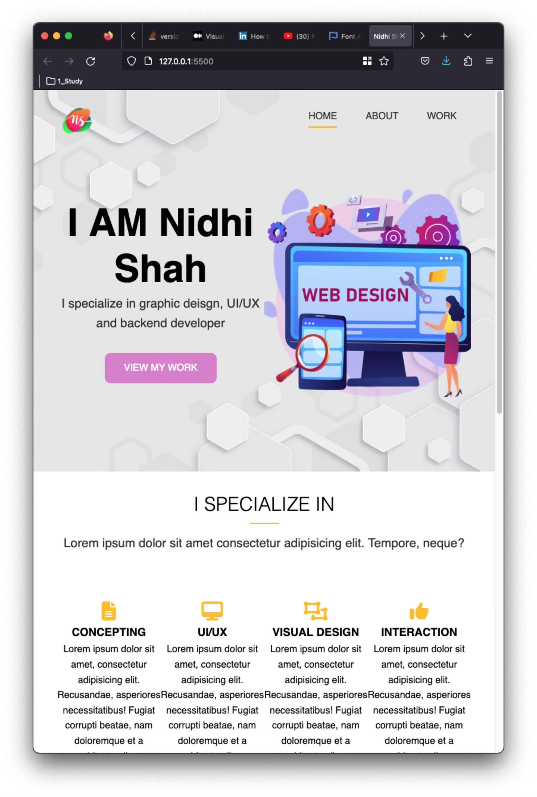

# Nidhi Shah Portfolio

   

     
   

## Description

    *Home Page highlights on what I am specialized in alongwith my key statistics like Projects, Clients worked with etc
    *About Page contains my key details
    *Work page showcase animation of overlay on the card layout. 
    

## Getting Started
### Dependencies
   NA

### Installing
   * Clone the repo
 
    

### Executing program
   NA
 

## Help
   NA

## Authors

Nidhi Shah

## Version History
    0.1
        Initial Release

## License
NA

## Acknowledgments

    *W3School 
    *Card Layout Animation : https://www.youtube.com/watch?v=-mX0QYj4xQo
    *Various Icons : https://fontawesome.com/ 
